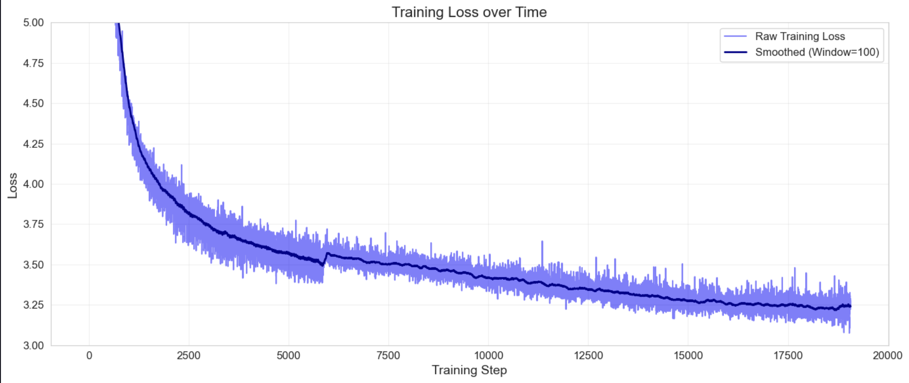
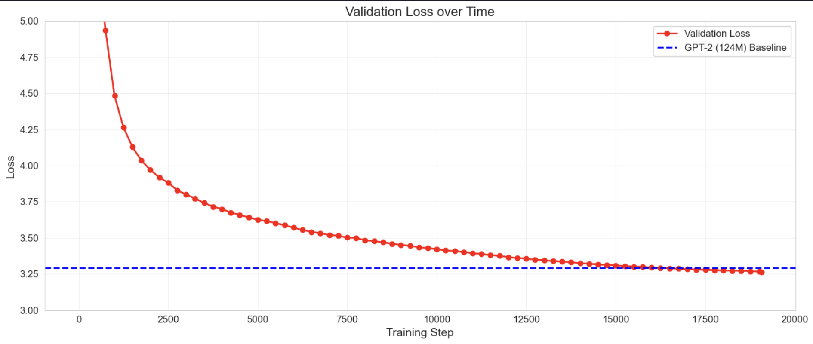
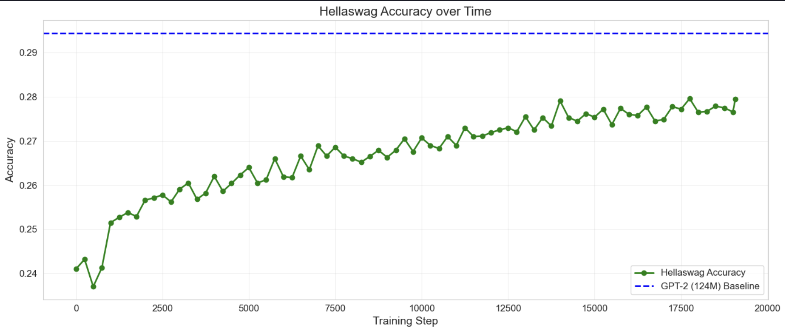

## 🚫 Vibe Coding Disclaimer

**Disclaimer**  
This repository was **not** created using “vibe coding.”

# GPT2-From-Scratch

A repository where I try to code GPT-2 from scratch by learning from Andrej Karpathy. The main goal of this project is to understand how is a GPT like model working under the hood by implementing it. This model tries to stick as close as possible to the information given in the GPT2 and GPT3 paper and as mentionned above, I implemented it by relying highly on this tutorial which is pure gold : https://youtu.be/l8pRSuU81PU?si=adpI_CVHitmNdv9G

## Description and further details

- In order to test the model througout its construction, I used a tiny dataset (moliere.txt) which is containing the writings from Moliere. 
- Once the model was mature enough to get trained on some legit data, I followed Andrej Karpathy's choice to train on FineWebEdu in order to make sure to use high quality data.
- Regarding the compute for this project, I rented 2x(H100 80Gb 700W) GPUs on https://cloud.vast.ai. We have to make sure to rent an instance having enough disk space, which is set very low by default on vast.ai.


## Useful Commands and Learnings

While working on this project, I've learned some useful commands and techniques, which I list here as a reminder for anyone including myself:

### 1. **Monitor GPU Usage**
   - To continuously monitor GPU usage every 2 seconds:
     ```bash
     watch -n 2 nvidia-smi
     ```

### 2. **SSH with Port Forwarding**
   - To SSH into a remote cluster and forward a port for accessing GPUs:
     ```bash
     ssh -p <PORT> <USER>@<REMOTE_HOST> -L <LOCAL_PORT>:localhost:<REMOTE_PORT>
     ```
   - This allows access to services running on a remote machine from your local system.

### 3. **Distributed Training with PyTorch**
   - To run a standalone multi-GPU training job:
     ```bash
     torchrun --standalone --nproc_per_node=<NUM_GPUS> train.py
     ```
   - Replace `<NUM_GPUS>` with the number of GPUs to use.

### 4. **Sync Files to Remote Server with `rsync`**
   - To transfer files from local to remote while showing progress:
     ```bash
     rsync -avz --progress -e "ssh -p <PORT>" "<LOCAL_PATH>" <USER>@<REMOTE_HOST>:<REMOTE_PATH>/
     ```
   - This ensures only modified files are transferred, saving time.
   - To transfer files from remote to local:
     ```bash
     rsync -avz --progress -e "ssh -p <PORT>" <USER>@<REMOTE_HOST>:<REMOTE_PATH> "<LOCAL_PATH>"
     ```

### 5. **Disable Auto-Tmux in SSH Sessions**
   - If the remote server automatically launches `tmux` and you want to disable it:
     ```bash
     touch ~/.no_auto_tmux
     ```
   - This prevents `tmux` from launching automatically, ensuring normal terminal behavior and especially get rid of synchronized terminals which can be annoying when we want to monitor.

### 6. **Technical Optimizations and Best Practices**
   - **Power of 2 Dimensions**
     - Using power of 2 for various dimensions improves performance:
       ```python
       vocab_size = 50304  # Power of 2 aligned
       total_batch_size = 524288  # 2**19
       micro_batch_size = 64  # Power of 2
       ```

   - **Mixed Precision Training**
     - Using `bfloat16` for better memory efficiency and speed:
       ```python
       with torch.autocast(device_type='cuda', dtype=torch.bfloat16):
           logits, loss = model(x, y)
       ```

   - **Torch Compile**
     - Enabling `torch.compile()`:
       ```python
       model = torch.compile(model)
       ```

   - **Flash Attention**
     - Using Flash Attention for efficient attention computation:
       ```python
       y = F.scaled_dot_product_attention(q, k, v, is_causal=True)
       ```

   - **Gradient Accumulation**
     - Implementing gradient accumulation for larger effective batch sizes:
       ```python
       loss = loss / grad_accum_steps
       loss.backward()
       ```

   - **Optimizer Configuration**
     - Using AdamW with fused kernels when available
     - Cosine weight decay (only on 2D parameters)
     - Beta parameters set to (0.9, 0.95)

   - **High Precision Matrix Multiplication**
     ```python
     torch.set_float32_matmul_precision('high')
     ```

   - **Distributed Training**
     - Support for multi-GPU training using DistributedDataParallel (DDP)
     - Efficient gradient synchronization
     - Proper process initialization and cleanup

   - **Learning Rate Schedule**
     - Linear warmup followed by cosine decay:
       ```python
       warmup_steps = 715  # 375M tokens / 2**19 tokens per step
       max_steps = 19073  # 10B tokens / 2**19 tokens per step
       min_lr = max_lr * 0.1  # Minimum learning rate is 10% of max
       ```

   - **Data Processing**
     - Efficient data sharding:
       - Using uint16 for token storage to save memory
       - 100M tokens per shard
       - Separate train/validation splits
       - Adding EOT tokens between documents
       - One note regarding the documents, these need to be shuffled if we ever train on several epochs as their order should not matter

   - **Model Initialization**
     - Zero initialization for biases
     - Normal distribution for embeddings
     - Special weight scaling for residual pathways:
       ```python
       std *= (2*n_layer)**-0.5  # Scale based on number of residual connections
       ```
     - Weight sharing between token embedding and final projection

   - **Gradient Clipping**
     - Clipping gradients to prevent exploding gradients:
       ```python
       norm = nn.utils.clip_grad_norm_(model.parameters(), 1.0)
       ```
     - Maximum gradient norm set to 1.0

---

## Results

### Training Loss Over Time


Just like Andrej Karpathy noticed it, we have some weird issue with the training loss, certainly due to the way our data is loaded. Our training loss curve looks decent but as we can observe, there is a tiny step up in the middle.

### Validation Loss Over Time (with GPT-2 124M Baseline)


We are outranking GPT2 on our validation loss even though it's not a fair comparison.

> **Baseline (GPT-2 124M)**: Loss = **3.2924**


### Hellaswag Accuracy Over Time (with GPT-2 124M Baseline)


We are not outranking GPT2 on our Hellaswag Accuracy. It is to be noted that we only trained on one epoch of 10B tokens while GPT2 was trained on 100B tokens. 

> **Baseline (GPT-2 124M)**: Accuracy = **0.294463**

Would love to tune it more, but GPUs don't exactly grow on trees yet in 2025!

